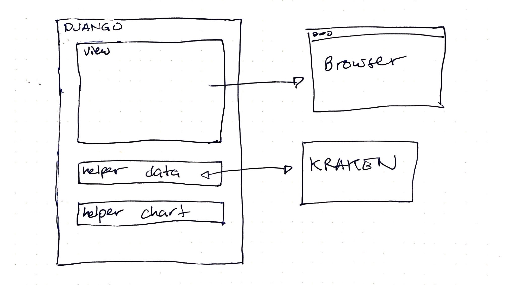

# Kraken Bitcoin Data Display

## Table of Contents

## Prerequisites
- Python 3
- Pip3
- Pipenv ``pip3 install pipenv``

## Overview
This application pulls data from the Kraken public api to display data using Python and Django, rendering the application view from the server.

Besides the default Django admin, there is only one view in this application which is the index function found [here](./crypto/crypto/views.py) and is loaded at the root url of the website.

Here is a simple diagram showing their relationship.

And a diagram showing the steps it takes through to the different portions of the application. Note, this does not show what Django does behind the scenes.

- The view holds the predetermined search query. The browser cannot customize the search preferences at this time.
- The view uses a helper function to make the query to Kraken and process the data it gets back to make sure it will be ready for the next step.
- The view uses another helper function to build a chart that is will later be added into the template view.
- The mean and median are calculated and added to the context.
- The view is processed by Django and sent to the browser.

## QUICKSTART
- In the terminal to the project root.
- Run ``pipenv shell``.
- Run ``pipenv install`` to install dependencies.
- Inside of the pipenv shell, navigate to the app folder ``cd crypto``. 
- Run the application using ``python manage.py runserver``.
- Once the server is running, in a browser, go to [http://127.0.0.1:8000/](http://127.0.0.1:8000/)

## TESTING THE APPLICATION
Inside of the running pipenv shell and inside of ``crypto/crypto`` folder where the ``manage.py`` file is located, run ``python manage.py test``.

## WISHLIST
- Make the application interactive so that the user can choose the dates, which currencies to pair, and the minute intervals as well.
- Possibly create Django models around the data especially if we find we have need to have longer persistence for the information.
- Structured Logging for better visibility.
- Maybe use of Django class based views.
- Use of make file and make commands.
- Precommit checks of linting and formatting.
- More robust testing especially of edge cases.